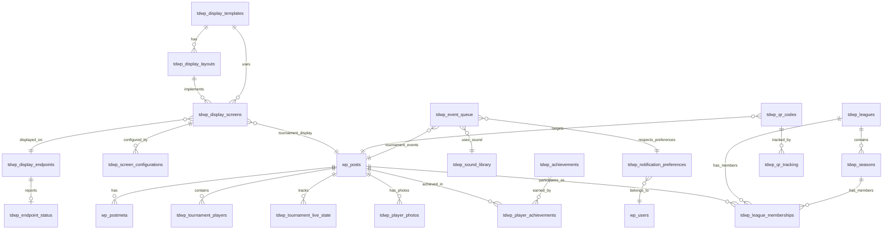

# TD3 Integration Database Schema Documentation

## Overview

This document outlines the complete database schema for TD3 (Tournament Director 3) integration features, designed to extend the existing WordPress poker tournament plugin with advanced display, notification, player engagement, QR code, and multi-screen capabilities.

## Design Principles

- **WordPress Compatibility**: Follows WordPress database conventions (wp_ prefix, proper data types)
- **Performance Optimized**: Strategic indexing for 1000+ player tournaments
- **Scalable Architecture**: Supports real-time updates and caching strategies
- **Data Integrity**: Foreign key relationships and proper constraints
- **Migration Ready**: Safe schema updates for existing installations

## Database Schema Diagram

## Table Definitions

### Display System Tables

#### `wp_tdwp_display_templates`
**Purpose**: Stores reusable display template configurations
**Primary Key**: `id`
**Indexes**: `name`, `template_type`, `is_default`, `is_active`, `created_by`

| Field | Type | Description |
|-------|------|-------------|
| `id` | bigint(20) UNSIGNED | Auto-increment primary key |
| `name` | varchar(255) | Template display name |
| `description` | text | Template description |
| `template_type` | varchar(50) | tournament, rankings, timer, etc. |
| `css_variables` | longtext | JSON configuration for CSS variables |
| `html_template` | longtext | HTML template content |
| `is_default` | tinyint(1) | Whether this is a default template |
| `is_active` | tinyint(1) | Whether template is currently active |
| `created_by` | bigint(20) UNSIGNED | WordPress user who created template |
| `created_at` | datetime | Creation timestamp |
| `updated_at` | datetime | Last update timestamp |

#### `wp_tdwp_display_layouts`
**Purpose**: Stores layout configurations for different screen types
**Primary Key**: `id`
**Indexes**: `template_id`, `screen_type`, `is_default`, `sort_order`, `template_screen`

| Field | Type | Description |
|-------|------|-------------|
| `id` | bigint(20) UNSIGNED | Auto-increment primary key |
| `template_id` | bigint(20) UNSIGNED | FK to display_templates |
| `name` | varchar(255) | Layout display name |
| `screen_type` | varchar(50) | main, secondary, mobile, etc. |
| `layout_config` | longtext | JSON layout configuration |
| `responsive_settings` | longtext | JSON responsive breakpoints |
| `is_default` | tinyint(1) | Whether this is default layout |
| `sort_order` | int | Display order |
| `created_at` | datetime | Creation timestamp |
| `updated_at` | datetime | Last update timestamp |

#### `wp_tdwp_display_screens`
**Purpose**: Stores active screen instances and assignments
**Primary Key**: `id`
**Indexes**: `tournament_id`, `screen_type`, `template_id`, `layout_id`, `endpoint_id`, `status`

| Field | Type | Description |
|-------|------|-------------|
| `id` | bigint(20) UNSIGNED | Auto-increment primary key |
| `tournament_id` | bigint(20) UNSIGNED | FK to wp_posts (tournament) |
| `screen_name` | varchar(255) | Screen display name |
| `screen_type` | varchar(50) | main, secondary, mobile |
| `template_id` | bigint(20) UNSIGNED | FK to display_templates |
| `layout_id` | bigint(20) UNSIGNED | FK to display_layouts |
| `endpoint_id` | bigint(20) UNSIGNED | FK to display_endpoints |
| `status` | varchar(20) | active, inactive, maintenance |
| `refresh_interval` | int | Refresh rate in seconds |
| `last_updated` | datetime | Last content update |
| `created_at` | datetime | Creation timestamp |
| `updated_at` | datetime | Last update timestamp |

#### `wp_tdwp_screen_configurations`
**Purpose**: Runtime configuration for active screens
**Primary Key**: `id`
**Unique Key**: `screen_config` (screen_id, config_key)
**Indexes**: `screen_id`, `config_key`, `is_system`

| Field | Type | Description |
|-------|------|-------------|
| `id` | bigint(20) UNSIGNED | Auto-increment primary key |
| `screen_id` | bigint(20) UNSIGNED | FK to display_screens |
| `config_key` | varchar(255) | Configuration parameter name |
| `config_value` | longtext | Configuration value |
| `data_type` | varchar(20) | string, number, boolean, json |
| `is_system` | tinyint(1) | Whether this is a system config |
| `updated_at` | datetime | Last update timestamp |

### Event Notification Tables

#### `wp_tdwp_event_queue`
**Purpose**: Event queue for tournament notifications
**Primary Key**: `id`
**Indexes**: `tournament_id`, `event_type`, `priority`, `status`, `scheduled_at`, `next_attempt`

| Field | Type | Description |
|-------|------|-------------|
| `id` | bigint(20) UNSIGNED | Auto-increment primary key |
| `tournament_id` | bigint(20) UNSIGNED | FK to wp_posts (tournament) |
| `event_type` | varchar(50) | level_change, bustout, registration |
| `priority` | int | Priority level (1-10) |
| `event_data` | longtext | JSON event details |
| `notification_data` | longtext | JSON notification details |
| `scheduled_at` | datetime | When to process event |
| `status` | varchar(20) | pending, processing, completed, failed |
| `attempts` | int | Number of processing attempts |
| `max_attempts` | int | Maximum retry attempts |
| `last_attempt` | datetime | Last processing attempt |
| `next_attempt` | datetime | Next retry attempt |
| `completed_at` | datetime | Completion timestamp |
| `error_message` | text | Error details if failed |
| `created_at` | datetime | Creation timestamp |
| `updated_at` | datetime | Last update timestamp |

#### `wp_tdwp_notification_preferences`
**Purpose**: User notification preferences
**Primary Key**: `id`
**Unique Key**: `user_tournament_event` (user_id, tournament_id, event_type, notification_method)
**Indexes**: `user_id`, `tournament_id`, `event_type`, `notification_method`, `is_enabled`

| Field | Type | Description |
|-------|------|-------------|
| `id` | bigint(20) UNSIGNED | Auto-increment primary key |
| `user_id` | bigint(20) UNSIGNED | FK to wp_users |
| `tournament_id` | bigint(20) UNSIGNED | FK to wp_posts (tournament) |
| `event_type` | varchar(50) | Type of event to notify for |
| `notification_method` | varchar(50) | screen, sound, email, push |
| `is_enabled` | tinyint(1) | Whether notifications are enabled |
| `sound_enabled` | tinyint(1) | Whether sound notifications enabled |
| `sound_file` | varchar(255) | Custom sound file |
| `volume_level` | int | Volume level (0-100) |
| `auto_popup` | tinyint(1) | Whether to auto-popup notifications |
| `duration_seconds` | int | Display duration |
| `priority_filter` | int | Minimum priority to notify |
| `created_at` | datetime | Creation timestamp |
| `updated_at` | datetime | Last update timestamp |

#### `wp_tdwp_sound_library`
**Purpose**: Sound files for event notifications
**Primary Key**: `id`
**Indexes**: `name`, `category`, `is_default`, `is_active`, `uploaded_by`

| Field | Type | Description |
|-------|------|-------------|
| `id` | bigint(20) UNSIGNED | Auto-increment primary key |
| `name` | varchar(255) | Sound display name |
| `description` | text | Sound description |
| `file_path` | varchar(500) | Local file path |
| `file_url` | varchar(500) | Public URL |
| `file_size` | bigint(20) | File size in bytes |
| `duration_ms` | int | Duration in milliseconds |
| `file_type` | varchar(50) | audio, video, etc. |
| `category` | varchar(100) | tournament, elimination, milestone |
| `is_default` | tinyint(1) | Whether this is a default sound |
| `is_active` | tinyint(1) | Whether sound is currently active |
| `uploaded_by` | bigint(20) UNSIGNED | WordPress user who uploaded |
| `created_at` | datetime | Creation timestamp |
| `updated_at` | datetime | Last update timestamp |

### Player Engagement Tables

#### `wp_tdwp_player_photos`
**Purpose**: Player photo references and metadata
**Primary Key**: `id`
**Indexes**: `player_id`, `is_primary`, `is_approved`, `uploaded_by`, `approved_by`

| Field | Type | Description |
|-------|------|-------------|
| `id` | bigint(20) UNSIGNED | Auto-increment primary key |
| `player_id` | bigint(20) UNSIGNED | FK to wp_posts (player) |
| `photo_url` | varchar(500) | Public photo URL |
| `thumbnail_url` | varchar(500) | Thumbnail URL |
| `photo_path` | varchar(500) | Local file path |
| `file_size` | bigint(20) | File size in bytes |
| `mime_type` | varchar(100) | Image MIME type |
| `upload_source` | varchar(50) | upload, import, webcam |
| `is_primary` | tinyint(1) | Whether this is primary photo |
| `is_approved` | tinyint(1) | Whether photo is approved |
| `uploaded_by` | bigint(20) UNSIGNED | User who uploaded |
| `approved_by` | bigint(20) UNSIGNED | User who approved |
| `created_at` | datetime | Creation timestamp |
| `updated_at` | datetime | Last update timestamp |

#### `wp_tdwp_achievements`
**Purpose**: Achievement definitions and criteria
**Primary Key**: `id`
**Indexes**: `name`, `category`, `achievement_type`, `is_active`, `is_hidden`, `sort_order`

| Field | Type | Description |
|-------|------|-------------|
| `id` | bigint(20) UNSIGNED | Auto-increment primary key |
| `name` | varchar(255) | Achievement display name |
| `description` | text | Achievement description |
| `icon_url` | varchar(500) | Achievement icon URL |
| `badge_color` | varchar(20) | Badge color (hex) |
| `category` | varchar(100) | tournament, bounty, chips |
| `achievement_type` | varchar(50) | tournament_win, final_table |
| `criteria_config` | longtext | JSON criteria configuration |
| `points_value` | int | Points awarded |
| `is_active` | tinyint(1) | Whether achievement is active |
| `is_hidden` | tinyint(1) | Whether achievement is hidden |
| `sort_order` | int | Display order |
| `created_by` | bigint(20) UNSIGNED | User who created |
| `created_at` | datetime | Creation timestamp |
| `updated_at` | datetime | Last update timestamp |

#### `wp_tdwp_player_achievements`
**Purpose**: Earned achievements by players
**Primary Key**: `id`
**Unique Key**: `player_achievement` (player_id, achievement_id)
**Indexes**: `player_id`, `achievement_id`, `tournament_id`, `earned_at`, `is_displayed`

| Field | Type | Description |
|-------|------|-------------|
| `id` | bigint(20) UNSIGNED | Auto-increment primary key |
| `player_id` | bigint(20) UNSIGNED | FK to wp_posts (player) |
| `achievement_id` | bigint(20) UNSIGNED | FK to achievements |
| `tournament_id` | bigint(20) UNSIGNED | FK to wp_posts (tournament) |
| `earned_at` | datetime | When achievement was earned |
| `progress_data` | longtext | JSON progress tracking |
| `is_displayed` | tinyint(1) | Whether to display achievement |
| `created_at` | datetime | Creation timestamp |

#### `wp_tdwp_leagues`
**Purpose**: League definitions and settings
**Primary Key**: `id`
**Indexes**: `name`, `league_type`, `is_active`, `is_private`, `created_by`

| Field | Type | Description |
|-------|------|-------------|
| `id` | bigint(20) UNSIGNED | Auto-increment primary key |
| `name` | varchar(255) | League display name |
| `description` | text | League description |
| `league_type` | varchar(50) | points, money, hybrid |
| `scoring_config` | longtext | JSON scoring configuration |
| `ranking_config` | longtext | JSON ranking configuration |
| `is_active` | tinyint(1) | Whether league is active |
| `is_private` | tinyint(1) | Whether league is private |
| `max_players` | int | Maximum players allowed |
| `created_by` | bigint(20) UNSIGNED | User who created |
| `created_at` | datetime | Creation timestamp |
| `updated_at` | datetime | Last update timestamp |

#### `wp_tdwp_seasons`
**Purpose**: Season definitions within leagues
**Primary Key**: `id`
**Indexes**: `league_id`, `start_date`, `end_date`, `is_active`, `sort_order`

| Field | Type | Description |
|-------|------|-------------|
| `id` | bigint(20) UNSIGNED | Auto-increment primary key |
| `league_id` | bigint(20) UNSIGNED | FK to leagues |
| `name` | varchar(255) | Season display name |
| `description` | text | Season description |
| `start_date` | date | Season start date |
| `end_date` | date | Season end date |
| `is_active` | tinyint(1) | Whether season is active |
| `sort_order` | int | Display order |
| `created_at` | datetime | Creation timestamp |
| `updated_at` | datetime | Last update timestamp |

#### `wp_tdwp_league_memberships`
**Purpose**: Player memberships in leagues and seasons
**Primary Key**: `id`
**Unique Key**: `league_season_player` (league_id, season_id, player_id)
**Indexes**: `league_id`, `season_id`, `player_id`, `membership_status`, `total_points`

| Field | Type | Description |
|-------|------|-------------|
| `id` | bigint(20) UNSIGNED | Auto-increment primary key |
| `league_id` | bigint(20) UNSIGNED | FK to leagues |
| `season_id` | bigint(20) UNSIGNED | FK to seasons |
| `player_id` | bigint(20) UNSIGNED | FK to wp_posts (player) |
| `membership_status` | varchar(20) | active, inactive, suspended |
| `join_date` | datetime | When player joined |
| `leave_date` | datetime | When player left |
| `total_points` | decimal(10,2) | Total points earned |
| `wins` | int | Number of wins |
| `final_tables` | int | Number of final tables |
| `cashes` | int | Number of cashes |
| `created_at` | datetime | Creation timestamp |
| `updated_at` | datetime | Last update timestamp |

### QR Code Tables

#### `wp_tdwp_qr_codes`
**Purpose**: Generated QR codes and metadata
**Primary Key**: `id`
**Indexes**: `qr_type`, `target_id`, `is_active`, `expiry_date`, `created_by`, `created_at`

| Field | Type | Description |
|-------|------|-------------|
| `id` | bigint(20) UNSIGNED | Auto-increment primary key |
| `qr_type` | varchar(50) | player, tournament, registration |
| `target_id` | bigint(20) UNSIGNED | Target record ID |
| `target_data` | longtext | JSON target data |
| `qr_data` | varchar(2000) | QR code data content |
| `qr_image_url` | varchar(500) | Generated image URL |
| `qr_image_path` | varchar(500) | Local image path |
| `title` | varchar(255) | QR code title |
| `description` | text | QR code description |
| `is_active` | tinyint(1) | Whether QR code is active |
| `expiry_date` | datetime | Expiration date |
| `max_scans` | int | Maximum allowed scans |
| `current_scans` | int | Current scan count |
| `created_by` | bigint(20) UNSIGNED | User who created |
| `created_at` | datetime | Creation timestamp |
| `updated_at` | datetime | Last update timestamp |

#### `wp_tdwp_qr_tracking`
**Purpose**: QR code scan tracking data
**Primary Key**: `id`
**Indexes**: `qr_id`, `scan_time`, `ip_address`, `user_id`, `device_type`, `session_id`

| Field | Type | Description |
|-------|------|-------------|
| `id` | bigint(20) UNSIGNED | Auto-increment primary key |
| `qr_id` | bigint(20) UNSIGNED | FK to qr_codes |
| `scan_time` | datetime | When QR code was scanned |
| `ip_address` | varchar(45) | Scanner IP address |
| `user_agent` | text | Browser user agent |
| `referrer_url` | varchar(500) | Referring page |
| `geo_location` | varchar(255) | Geographic location |
| `device_type` | varchar(50) | mobile, desktop, tablet |
| `browser_type` | varchar(100) | Browser identification |
| `session_id` | varchar(255) | Session identifier |
| `user_id` | bigint(20) UNSIGNED | FK to wp_users |
| `scan_context` | longtext | JSON additional context |

### Multi-Screen Endpoint Tables

#### `wp_tdwp_display_endpoints`
**Purpose**: Multi-screen endpoint configurations
**Primary Key**: `id`
**Indexes**: `endpoint_name`, `endpoint_type`, `status`, `is_active`, `last_heartbeat`, `created_by`

| Field | Type | Description |
|-------|------|-------------|
| `id` | bigint(20) UNSIGNED | Auto-increment primary key |
| `endpoint_name` | varchar(255) | Endpoint display name |
| `endpoint_type` | varchar(50) | web, mobile, tv, projector |
| `endpoint_url` | varchar(500) | Endpoint URL |
| `api_key` | varchar(255) | API authentication key |
| `api_secret` | varchar(255) | API secret |
| `screen_resolution` | varchar(50) | Screen resolution |
| `orientation` | varchar(20) | landscape, portrait |
| `refresh_rate` | int | Refresh rate in seconds |
| `status` | varchar(20) | online, offline, error |
| `last_heartbeat` | datetime | Last status update |
| `location_info` | longtext | JSON location details |
| `config_settings` | longtext | JSON configuration |
| `is_active` | tinyint(1) | Whether endpoint is active |
| `created_by` | bigint(20) UNSIGNED | User who created |
| `created_at` | datetime | Creation timestamp |
| `updated_at` | datetime | Last update timestamp |

#### `wp_tdwp_endpoint_status`
**Purpose**: Real-time status for display endpoints
**Primary Key**: `id`
**Unique Key**: `endpoint_id`
**Indexes**: `screen_id`, `status`, `last_heartbeat`, `status_updated`

| Field | Type | Description |
|-------|------|-------------|
| `id` | bigint(20) UNSIGNED | Auto-increment primary key |
| `endpoint_id` | bigint(20) UNSIGNED | FK to display_endpoints |
| `screen_id` | bigint(20) UNSIGNED | FK to display_screens |
| `status` | varchar(20) | online, offline, buffering |
| `cpu_usage` | decimal(5,2) | CPU usage percentage |
| `memory_usage` | decimal(5,2) | Memory usage percentage |
| `network_quality` | int | Network quality score |
| `current_viewers` | int | Current viewer count |
| `buffer_health` | int | Buffer health percentage |
| `last_render_time` | int | Last render time in ms |
| `error_count` | int | Recent error count |
| `last_error` | text | Last error message |
| `status_data` | longtext | JSON additional status |
| `updated_at` | datetime | Last update timestamp |

## Performance Considerations

### Index Strategy
- **Composite Indexes**: Created for common query patterns (tournament_id + status, player_id + tournament_id)
- **Time-based Indexes**: All timestamp fields are indexed for efficient time-based queries
- **Foreign Key Indexes**: All foreign key relationships are indexed
- **Unique Constraints**: Prevent duplicate data where business rules require uniqueness

### Scaling for Large Tournaments
- **Event Queue**: Designed for high-volume event processing with batch operations
- **Display Screens**: Optimized for frequent updates with minimal database overhead
- **QR Tracking**: Uses efficient storage for high-volume scan data
- **Endpoint Status**: Lightweight updates for real-time monitoring

### Caching Strategy
- **Display Templates**: Cache rendered HTML/CSS combinations
- **Player Photos**: Cache resized thumbnails
- **Achievement Data**: Cache calculated achievement progress
- **League Standings**: Cache computed rankings and statistics

## Data Validation Rules

### Input Validation
- **Text Fields**: Length limits enforced at database level
- **Numeric Fields**: Proper data types with appropriate precision
- **JSON Fields**: Validated JSON format stored as text
- **Dates**: Proper datetime formats with timezone support
- **URLs**: Validated URL format for file paths and links

### Business Logic Validation
- **Tournament Status**: Prevent invalid state transitions
- **Player Registration**: Enforce tournament capacity limits
- **Achievement Criteria**: Validate achievement rule configurations
- **QR Code Limits**: Enforce scan limits and expiry dates
- **Endpoint Authentication**: Secure API key management

## Migration Strategy

### Version Control
- **Database Versioning**: Each schema update increments version number
- **Migration Scripts**: Separate migration functions for each version
- **Rollback Support**: Ability to rollback failed migrations
- **Data Preservation**: Migrations preserve existing data integrity

### Upgrade Path
- **Phase 1**: Create new tables without affecting existing functionality
- **Phase 2**: Migrate existing data to new structures if needed
- **Phase 3**: Update application code to use new schema
- **Phase 4**: Remove deprecated tables after successful migration

### Backward Compatibility
- **Legacy Support**: Maintain compatibility with existing tournament data
- **Feature Flags**: Enable/disable new features during migration
- **Graceful Degradation**: Fallback functionality if new features unavailable
- **Data Validation**: Verify data integrity after migration completion

## Integration with Existing System

### Relationship to Current Tables
- **Tournament Posts**: Links to existing wp_posts for tournament data
- **Player Posts**: Links to existing wp_posts for player profiles
- **User System**: Integrates with WordPress user management
- **Media Library**: Uses WordPress media handling for photos and sounds

### API Integration
- **REST Endpoints**: Extend existing API with TD3 features
- **WebSocket Support**: Real-time updates for display screens
- **Webhook Integration**: Event-driven notifications
- **Third-party APIs**: Support for external display systems

### Security Considerations
- **Access Control**: Role-based permissions for TD3 features
- **Data Privacy**: Player photo consent and privacy controls
- **API Security**: Secure endpoint authentication
- **Audit Trail**: Complete logging of TD3 feature usage

## Implementation Notes

### Performance Monitoring
- **Query Optimization**: Monitor slow queries and optimize indexes
- **Cache Hit Rates**: Track caching effectiveness
- **Database Size**: Monitor growth and plan for scaling
- **Event Queue Performance**: Track processing times and bottlenecks

### Maintenance Procedures
- **Regular Cleanup**: Remove expired QR codes and old tracking data
- **Data Archival**: Archive historical tournament data
- **Performance Tuning**: Regular database optimization
- **Backup Strategy**: Ensure reliable backup procedures

### Troubleshooting
- **Connection Issues**: Diagnose endpoint connectivity problems
- **Display Rendering**: Debug template and layout issues
- **Event Processing**: Monitor event queue bottlenecks
- **Data Synchronization**: Ensure consistency across multiple screens

This schema provides a comprehensive foundation for TD3 integration while maintaining compatibility with the existing WordPress poker tournament plugin architecture.